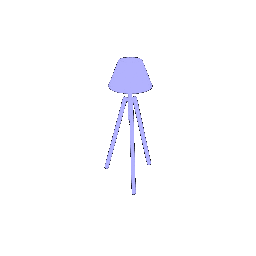
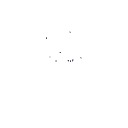

Point Cloud Classification and Segmentation
========================
**Name: Omkar Chittar**  
------------------------
```
PointCloud_Classification_and_Segmentation
+-checkpoints
+-data
+-logs
+-output
+-output_cls
+-output_cls_numpoints
+-output_cls_rotated
+-output_seg
+-output_seg_numpoints
+-output_seg_rotated
+-README.md
+-report
data_loader.py
eval_cls_numpoints.py
eval_cls_rotated.py
eval_cls.py
eval_seg_numpoints.yml
eval_seg_rotated.py
eval_seg.py
models.py
train.py
utils.py
```

# **Installation**

- Download and extract the files.
- Make sure you meet all the requirements given on: https://github.com/848f-3DVision/assignment2/tree/main
- Or reinstall the necessary stuff using 'environment.yml':
```bash
conda env create -f environment.yml
conda activate pytorch3d-env
```
## Data Preparation
Download zip file (~2GB) from https://drive.google.com/file/d/1wXOgwM_rrEYJfelzuuCkRfMmR0J7vLq_/view?usp=sharing. Put the unzipped `data` folder under root directory. There are two folders (`cls` and `seg`) corresponding to two tasks, each of which contains `.npy` files for training and testing.
- The **data** folder consists of all the data necessary for the code.
- There are 6 output folders: 
    1. **output_cls** folder has all the images/gifs generated after running ```eval_cls.py```.
    2. **output_seg** folder has all the images/gifs generated after running ```eval_seg.py```.
    3. **output_cls_numpoints** folder has all the images/gifs generated after running ```eval_cls_numpoints.py```.
    4. **output_seg_numpoints** folder has all the images/gifs generated after running ```eval_seg_numpoints.py```.
    5. **output_cls_rotated** folder has all the images/gifs generated after running ```eval_cls_rotated.py```.
    6. **output_seg_rotated** folder has all the images/gifs generated after running ```eval_seg_rotated.py```.
- All the necessary instructions for running the code are given in **README.md**.
- The folder **report** has the html file that leads to the webpage.


# **1. Classification Model**
I implemented the PointNet architecture.

- After making changes to:
    1. `models.py` 
    2. `train.py`
    3. `eval_cls.py`

Run the code:  
```bash
python train.py --task cls
```
The code trains the model for the classification task. 

Evaluate the trained model by running the code:
```bash
python eval_cls.py
```
Evaluates the model for the classification task by rendering point clouds named with their ground truth class and their respective predicted class. Displays the accuracy of the trained model in the terminal. The rendered point clouds are saved in the **output_cls** folder.

The test accuracy of the model is stored as **`best_model.pt`** in the **`./checkpoints/cls`** folder and has a value **0.9769**

## Results

### Correct Classifications


| Point Cloud|      |                  | Ground truth Class | Predicted Class |
|:-----------|------------|:----------:|--------------------|-----------------|
|  |  |  | Chair              | Chair           |
|  |  |  | Vase               | Vase            |
|  |  |  | Lamp               | Lamp            |


### Incorrect Classifications


| Point Cloud | Ground Truth Class | Predicted Class |
|:-----------:|:------------------:|:---------------:|
|  | Chair | Lamp |
|  | Vase | Lamp |
|  | Lamp | Vase |

Analysis
-------------------------------------------------------------------------------

The misclassifications made by the PointNet model on the few failure cases seem to be due to those examples deviating significantly from the norm for their respective categories. For instance, the misclassified chair examples have unusual or atypical designs - one is folded up and missing a seat, while the other is unusually tall. Similarly, some of the misclassified vases and lamps have shapes that overlap more with the opposing class. 
Additionally, the chair class appears to have less shape variety overall compared to vases and lamps. Chairs components tend to be more standardized (seat, legs, back, etc). In contrast, the vase and lamp categories exhibit greater diversity in proportions and silhouettes (floor lamps vs desk lamps, vases with or without flowers etc). The model's confusion between these two classes likely stems from their greater morphological similarity in many cases - symmetry about the vertical axis, cylindrical profiles etc.


# **2. Segmentation Model**
I implemented the PointNet architecture.

- After making changes to:
    1. `models.py` 
    2. `train.py`
    3. `eval_seg.py`

Run the code:  
```bash
python train.py --task seg
```
The code trains the model for the Segmentation task. 

Evaluate the trained model by running the code:
```bash
python eval_seg.py
```
Evaluates the model for the Segmentation task by rendering point clouds with segmented areas with different colors. The rendered point clouds are saved in the **output_seg** folder. Displays the accuracy of the trained model in the terminal.

The test accuracy of the model is stored as **`best_model.pt`** in the **`./checkpoints/seg`** folder and has a value **0.9022**


## Results

### Good Predictions

| Ground truth point cloud | Predicted point cloud | Accuracy |
|:------------------:|:---------------:|:--------------------:|
|         |      | 0.9836 |
|         |      | 0.9237 |
|         |      | 0.917 |

### Bad Predictions

| Ground truth point cloud | Predicted point cloud | Accuracy |
|:------------------:|:---------------:|:--------------------:|
|         |      | 0.5171 |
|         |      | 0.4776 |
|         |      | 0.5126 |

Analysis:
-------------------------------------------------------------------------------

The model struggles to accurately segment sofa-like chairs where the boundaries between components like the back, headrest, armrests, seat and legs are less defined. The blending of these parts without clear delineation poses a challenge. Similarly, chairs with highly irregular or atypical shapes and geometries also confuse the model as they deviate significantly from the distribution of point clouds seen during training. 
On the other hand, the model performs very well in segmenting chairs with distinct, well-separated components like a distinct back, seat, separable arm rests and discrete legs. Chairs that have intricate details or accessories that overlap multiple segments, like a pillow over the seat and back, trip up the model. In such cases, there is often bleeding between segments, with the model unable to constrain a larger segment from encroaching on adjacent smaller segments.


# **3. Robustness Analysis**
## **3.1. Rotating the point clouds** 
Here we try to evaluate the accuracy of the classification as well as the segmentation models by rotating the point clouds around any one axis (x/y/z) or their permutations.
Rotate each evaluation point cloud around x-axis for 30, 60 and 90 degrees.
I have written the code to loop over specific object indices and while looping over various thetas (angles).


### 3.1.1. Classification
Run the code:
```bash
python eval_cls_rotated.py
```
Evaluates the model with rotated inputs for the classification task by rendering point clouds named with their rotated angle, ground truth class and their respective predicted class. Displays the accuracy of the trained model in the terminal. The rendered point clouds are saved in the **output_cls_rotated** folder.

| Class | Ground Truth | 30 deg | 60 deg | 90 deg |
|:-----:|:------------:|:------:|:------:|:------:|
| Chair |  |  |  |  |
| Vase |  |  |  |  |
| Lamp |  |  |  |  |
| Test Accuracy | 0.9769 | 0.7992 | 0.2235 | 0.3012 |

### 3.1.2. Segmentation
Run the code:
```bash
python eval_seg_rotated.py
```
Evaluates the model with rotated inputs for the segmentation task by rendering point clouds named with their rotated angle, and prediction accuracy. Displays the accuracy of the trained model in the terminal. The rendered point clouds are saved in the **output_seg_rotated** folder.

|  | 0 deg | 30 deg | 60 deg | 90 deg |
|--|:------------:|:------:|:------:|:------:|
|  |  |  |  |  |
|  |  |  |  |  |
|  |  |  |  |  |
| Test Accuracy | 0.9022 | 0.7992 | 0.399 | 0.1319 |

### Analysis

The model struggles to make accurate predictions when the point cloud is rotated dramatically away from an upright orientation. This limitation is likely due to the lack of data augmentation during training to include non-upright point cloud configurations. Without exposure to rotated variants of the object classes, the model fails to generalize to point clouds that deviate hugely from the expected upright positioning seen in the training data. Incorporating point cloud rotations during training data generation would likely improve the model's ability to recognize and segment objects despite major shifts in orientation. By augmenting the data to simulate tilted, skewed or even completely inverted point clouds, the model could become invariant to orientation and handle such cases gracefully during prediction.


## **3.2. Varying the sampled points in the point clouds** 
Here we try to evaluate the accuracy of the classification as well as the segmentation models by varying the number of sampled points in the point clouds.
I have written the code to loop over specific object indices and while looping over various num_points.

### 3.2.1. Classification
Run the code:
```bash
python eval_cls_numpoints.py
```
Evaluates the model with varying number of sampled points inputs for the classification task by rendering point clouds named with their index, number of points, ground truth class and their respective predicted class. Displays the accuracy of the trained model in the terminal. The rendered point clouds are saved in the **output_cls_numpoints** folder.

| Class | 10 | 100 | 1000 | 10000 |
|:-----:|:------------:|:------:|:------:|:------:|
| Chair |  |  |  |  |
| Vase |  |  |  |  |
| Lamp |  |  |  |  |
| Test Accuracy | 0.5012 | 0.8255 | 0.8992 | 0.9769 |

### 3.2.2. Segmentation
Run the code:
```bash
python eval_seg_numpoints.py
```
Evaluates the model with varying number of sampled points inputs for the segmentation task by rendering point clouds named with their index, number of points, and their respective predicted class accuracy. Displays the accuracy of the trained model in the terminal. The rendered point clouds are saved in the **output_seg_numpoints** folder.

|  | 10 | 100 | 1000 | 10000 |
|--|:------------:|:------:|:------:|:------:|
|  |  |  |  |  |
|  |  |  |  |  |
|  |  |  |  |  |
| Test Accuracy | 0.4673 | 0.7992 | 0.8599 | 0.9022 |

### Analysis

The model demonstrates considerable robustness to sparsity in the point cloud inputs. With as few as 10 points, it can achieve 25% test accuracy, rising rapidly to 80% accuracy with only 50 points. This suggests the model is able to infer the correct shape from even a very sparse sampling of points. However, its ability to generalize from such limited information may be challenged as the number of classes increases. Discriminating between more categories with fewer representative points could lower the accuracy, despite the architectural design choices to promote invariance to input sparsity. There may be a threshold minimum density below which the lack of key shape features impedes reliable classification, especially with additional object classes added. But with this 3 class dataset, the model's performance from merely 50 input points indicates surprising generalizability from scant point data. 


# **4. Webpage**
The html code for the webpage is stored in the *report* folder along with the images/gifs.
Clicking on the *webpage.md.html* file will take you directly to the [webpage](https://github.com/omkarchittar/PointCloud_Classification_and_Segmentation/blob/main/report/webpage.md.html).


